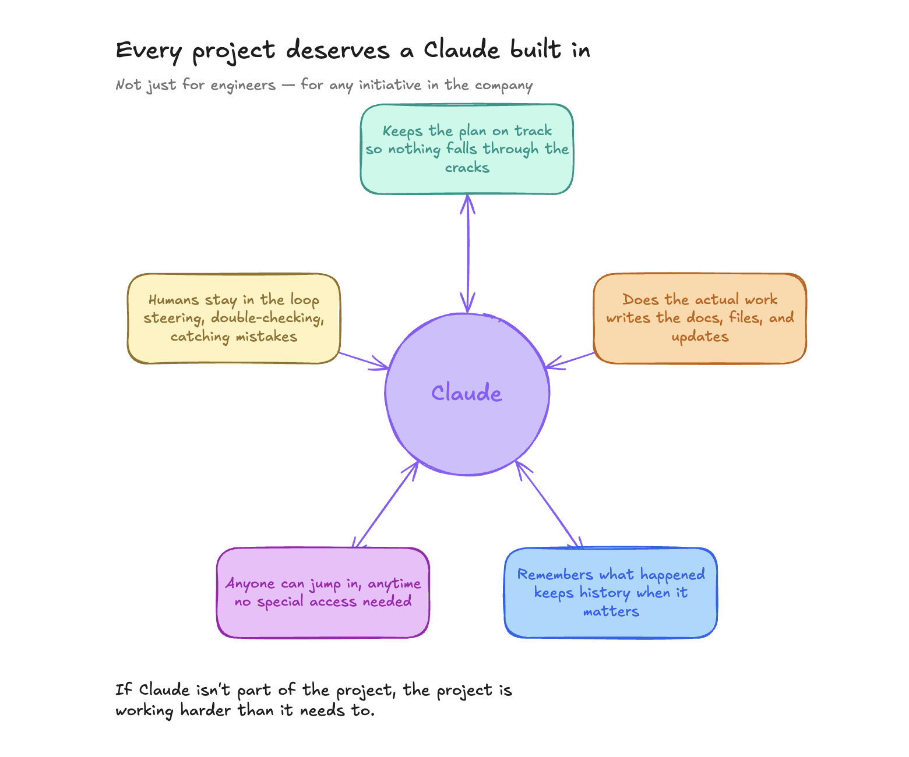
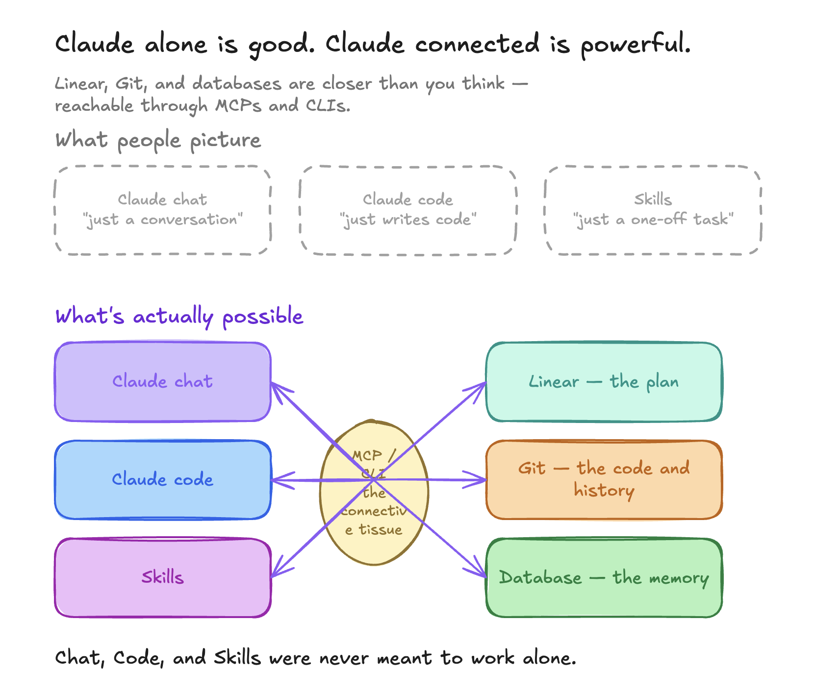
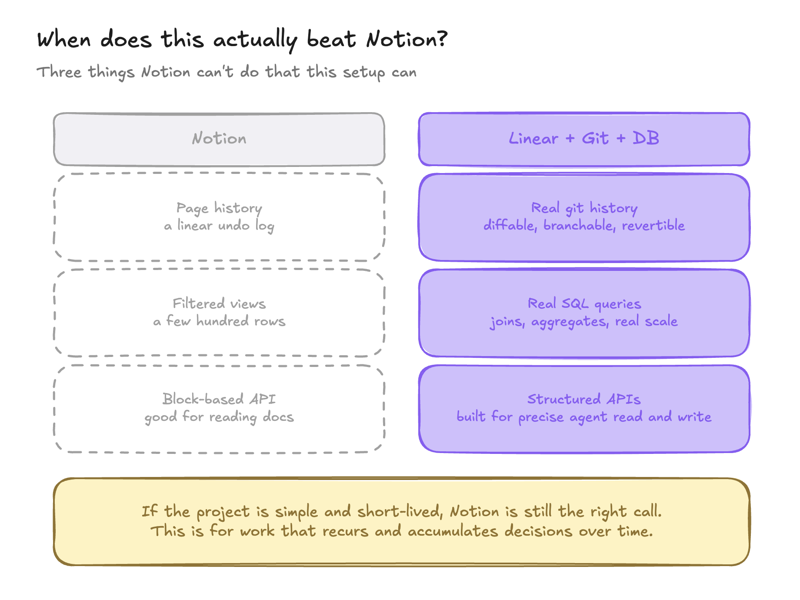
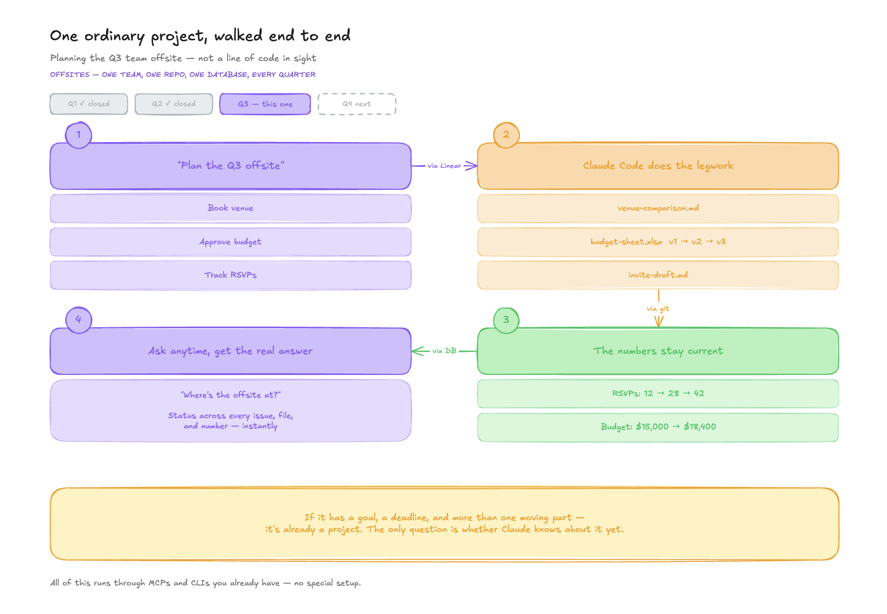

# Claude, Built In

**The best operators are about to run far more projects — with far more people in them — than they ever could before, and get there faster and with fewer mistakes. That depends on which tools Claude has, not just that it has some: a real issue tracker, real version history, and a real database working together do something a Notion page and a spreadsheet can't. This is the starter kit for that combination — giving Claude a real home in every project, not just a chat window.**

**Who this is for (a guess, not a gate):** probably the best fit is small or early-stage teams who can set this up quickly and don't have a pile of existing tooling to unwind first — but that's untested. If you're not that, this may still be worth five minutes; we just don't know yet.



## What's involved

| | |
|---|---|
| **[Claude Chat](https://claude.ai)** | The assistant's home base. Set up as a Project so it remembers this setup and doesn't start from scratch each time — ask questions, update Linear, get charts and reports rendered right in the conversation. |
| **[Claude Code](https://claude.ai/code)** | The only reliable way to actually write to the repo. Requires at least a Pro subscription — no free tier. |
| **[GitHub](https://github.com)** | Where code, diagrams, and file history live |
| **[Linear](https://linear.app)** | Where the plan lives — milestones, issues, what's done and what's left |
| **[Neon](https://neon.com)** | Where structured data lives — the numbers a project accumulates over time |

Connected that way, Claude can keep a plan on track, do the actual work (docs, files, updates), and hold a live record of what happened. GitHub, Linear, and Neon are free to use for this. Claude's Projects feature is on the free plan too — though Project Instructions, which this kit's whole approach depends on, may require a paid Claude plan. Anthropic's own documentation isn't fully consistent on this point, so it's worth checking your account directly rather than trusting this page either way.

This repo is itself the working example: this GitHub repo is public, and you're already looking at it. The Linear project tracking this kit's own build-out, and the Neon database behind the Offsites example, are real too — just not something we can link you into directly, since Linear and Neon don't offer public read-only views the way GitHub does.

## The fastest way to start: just ask Claude

Not sure yet whether this is worth setting up? Paste this into a chat with Claude first:

> Take a look at github.com/saaswise-cc/claude-builtin — in plain terms, what would this actually help me do, and why should I care? Ask me a question or two about the kind of work I do if that'll help you give a real answer, and be honest if you don't think it'd be useful for me.

Ready to actually build it? You don't need to read anything else on this page first — go to [claude.ai](https://claude.ai), start a new chat, and paste this instead:

> I want to set up the "Claude, Built In" starter kit from github.com/saaswise-cc/claude-builtin. I've never used Claude, GitHub, Linear, or Neon before — walk me through it step by step, starting with whatever comes first, and adjust as we go based on what I already have set up.

This repo is public, so Claude can read it directly and walk you through account creation, connecting the tools, and building your own version conversationally — asking what you need instead of you having to parse a long document alone. That's not a gimmick to shorten this page; it's the actual point of the project.

Prefer to read the full walkthrough yourself, at your own pace, instead? Everything below covers the same ground in writing — click any section to expand it.

## The value, in short

- **Chat and Code were never meant to work alone.** Both can reach a project's plan, its files, and its data — through connectors and CLIs most people already have access to, not special setup.

  

- **If it has a goal, a deadline, and more than one moving part, it's already a project.** The only question is whether Claude knows about it yet.
- **The tools you connect it to aren't interchangeable.** Notion and a spreadsheet can hold information, but they can't give Claude a real issue tracker's state machine, real version history to diff against, or a real database to query and grow over time. Structured interfaces mean fewer mistakes and faster answers — not just a different place to write things down.
- **Starting something new — and setting its pace — is still your call.** Claude can scaffold the plan, write the docs, and flag what's ready to move once a project exists. But kicking one off, and deciding when it actually moves forward, depends on things Claude usually can't see. It waits for you to say "let's do this" — and for you to say "now."
- **This isn't for everything.** If the work is simple and short-lived, a doc or a Notion page is still the right call. This is for work that recurs and accumulates decisions over time.

  

Here's what that looks like as a real example, not just an abstraction:



See `/deck` for the full deck and `/diagrams` for the rest of the visual walkthrough this argument is built on.

## What's in this repo

```
/README.md              — this file
/diagrams               — the four diagrams behind the framework (PNG)
/deck                   — the full deck (.pdf)
/db/schema.sql          — the Neon schema used by this project's own engagement tracking
/project-template       — the Claude Project instructions template (see Step 1)
/examples/offsites      — a fully worked example: real Linear structure, real schema, real data
.mcp.json               — connects Claude Code to Linear automatically (see the GitHub section)
/LICENSE                — MIT
```

---

## The full written walkthrough

<details>
<summary><strong>Getting Started — the Claude Project first, then four accounts</strong></summary>

You don't need to know how to code to follow this. You don't even need to have used Claude, GitHub, Linear, or a database before — this section assumes you haven't.

One honest caveat: "you don't need to know how to code" describes *what you need to know*, not how simple the underlying setup is — GitHub App permissions, Claude Code's Cloud vs. Local distinction, and connector configuration are all genuinely intricate under the hood, as the rest of this guide shows in detail. The actual promise is that Claude walks you through that complexity conversationally, adapting to whatever you already have set up — not that the process itself is trivial.

The short version of what you're building: instead of Claude living only in a chat window, you're giving it a **place to keep the plan** (Linear), **a place to do the work** (GitHub), and **a place to remember what happened** (a database, via Neon). Once those three exist, Claude can read and write to all of them directly — so a plan doesn't drift out of sync with the work, and the work doesn't drift out of sync with the record.

Getting there takes one Project to set up and four accounts to create — in this order:

### 1. Set up your Claude Project — start here

Before wiring up any accounts, set up the thing that ties them all together: a **Claude Project**. A Project in Claude is a persistent workspace with its own **instructions** (rules Claude follows in every chat) and **knowledge** (reference material it re-reads) — so Claude doesn't start from a blank slate each time.

This kit ships those instructions ready to use: **[`project-template/claude-project-instructions.md`](project-template/claude-project-instructions.md)**. It encodes the operating agreement itself — which tool owns what, how Chat and Code divide the work, the review loop, and where a human stays in the loop — not just how to connect things.

To set it up: create a new Project in Claude, then paste the contents of that template into the Project's **instructions**. (No Claude account yet? Create one first — that's the very next step — then come back here.) From then on, every chat inside that Project starts already knowing how this is meant to work.

**Why not just use Claude Code for everything?** You technically could — Code can hold standing instructions via a CLAUDE.md file and can connect to Linear and Neon too. But it's worth knowing what that actually costs before deciding:

- **Claude Code has no free tier at all** — Pro minimum, even for light use. Chat is free to start, though Project Instructions specifically may not be (see the note above).
- **Code is genuinely pricier per casual question** — every turn reloads its system prompt, your CLAUDE.md, and any connected MCP server's tool schemas before your question even starts.
- **You lose inline charts and reports** — Chat renders these directly; Code would have to write a file to the repo instead.
- **Projects keep multiple efforts organized** — a simple switcher, versus juggling separate repo checkouts.

None of this makes Code a bad tool — it's the only reliable way to write to the repo, and essential for that. It's just not a substitute for also having a Project. They're meant to work together, not as alternatives. For the fuller picture — including which of you should default to which surface, and what extra discipline Code-primary work needs — see "Which surface should I be in?" further down.

### 2. Claude — the assistant that does the work

Claude is Anthropic's AI assistant. In this setup, Claude is the one actually writing the docs, filing the issues, and keeping things updated — not just answering questions in a chat window.

👉 **Sign up at [claude.ai](https://claude.ai)** (free to start).

### 3. GitHub — where the code, diagrams, and history live

GitHub hosts this project's code, diagrams, and a full history of every change anyone's ever made to it. If you've never used it, think of it as a shared, permanent, undoable-by-nobody filing cabinet.

👉 **Sign up at [github.com/signup](https://github.com/signup)** — free, and covers everything here. GitHub's free plan includes unlimited repositories either way, so "public" vs "private" is a choice you make per-repo, not a paid feature.

**Public or private — which should you pick?**

This starter kit itself is public: the whole point is for strangers to be able to read it, fork it, and learn from it. But if you're using this same framework (Claude + GitHub + Linear + Neon) for your own project — a client's work, something with real user data, anything not meant for strangers — make the repo **private** instead. You can do this at creation time, or flip an existing repo's visibility later from **Settings → General → Danger Zone → Change visibility** in GitHub.

A rough rule: if you'd be comfortable with a stranger reading every file and every commit message, public is fine. If there's anything in there you wouldn't want a competitor, a client, or the internet at large to see — company names, credentials, internal numbers, unreleased plans — keep it private.

### 4. Linear — where the plan lives

Linear holds the project overview and the list of things left to do (called "issues"). It's the answer to "what are we working on and what's left" at a glance, instead of that answer being scattered across chats and memory.

👉 **Sign up at [linear.app/signup](https://linear.app/signup)** and choose the **free plan** — it covers everything this project needs.

### 5. Neon — where the numbers live

Neon gives you a real Postgres database without having to manage a server. It's where structured, ongoing numbers get tracked — the kind of thing a spreadsheet or a doc starts to strain under once it accumulates over time.

👉 **Sign up at [console.neon.tech/signup](https://console.neon.tech/signup)** — free tier, **no credit card required**.

*Advanced option, most people can skip this:* Neon is also [open source](https://github.com/neondatabase/neon) and can be self-hosted instead of using Neon's cloud service — worth knowing about if data residency, compliance, or avoiding a third-party vendor matters for your use case. Be honest with yourself about this one, though: self-hosting means building and running Neon's own storage engine (separate components called a Pageserver, Safekeepers, and compute nodes), not just running a single Docker container. It's a real infrastructure undertaking, not a beginner path — the signup link above is the right choice for almost everyone following this guide.

**A safety note, not just a setup note:** GitHub's workflow has a built-in review gate — nothing merges without a PR. Neon doesn't have an equivalent enforced by this kit, so it's worth deliberately building in: use Neon's own branching feature to test changes before they hit the branch that matters, and consider a read-only role for anyone who only needs to query data, not write it. The Claude Project instructions template treats destructive SQL as something that always needs an explicit confirm — worth keeping that rule even if you adapt everything else.

Once you have all four accounts, each service above has its own help docs linked from its sign-up page if you get stuck on any single step — this guide only covers the "why," not every click of the "how."

</details>

<details>
<summary><strong>Connecting Claude to Linear, Neon, and GitHub</strong></summary>

Having the four accounts isn't the same as having them talk to each other. This is the step that actually makes the value real — and Linear, Neon, and GitHub each connect a little differently, so it's worth knowing which is which before you start.

### Linear: a one-click directory connector

Linear is a native connector — Anthropic and Linear have already done the setup work, so it's just a search-and-click:

1. In Claude, click the **"+" button** in the lower-left of the chat box (or type **/**), then choose **Connectors → Browse connectors**
2. Search for **Linear**, click **Connect**, and sign in to authorize it

### Neon: a custom connector (one extra step, still simple)

Neon isn't in Claude's built-in directory the same way Linear is — you add it as a **custom connector**, which just means pasting in Neon's server address instead of finding it in a search list:

1. Go to **Customize → Connectors** in Claude settings
2. Click the **"+"**, then choose **Add custom connector**
3. In the **Name** field, enter `Neon`. In the **Remote MCP server URL** field, enter `https://mcp.neon.tech/mcp`
4. Click **Add**, then follow the browser prompt to sign in and authorize it

That's it either way — from then on, in any conversation, Claude can read and write issues in Linear and query/update your Neon database directly, without you copying anything back and forth. One note if you're on Claude's free plan: custom connectors are limited to one at a time on that plan, which is no problem here since Neon is the only one this project needs.

### GitHub: needs Claude Code, not the regular chat connector

This is the nuance worth knowing up front: the GitHub connector available in regular Claude chat is **read-only** — it lets Claude reference files from a repo you already have, but it can't create a repo or push changes. Also worth noting: even reading a private repo through this chat connector can be unreliable — reports show it failing intermittently even when properly authorized. If Claude in chat seems to be missing something from your repo that you know is there, that's likely why — Claude Code doesn't have this problem. To actually have Claude create and manage a repo, you need **Claude Code** (Anthropic's coding tool). (For the fuller picture on when to default to Chat versus Code day-to-day, see "Which surface should I be in?" further down.) Here's the easiest version, which needs no local installation:

1. **Create an empty repository first.** Go to [github.com/new](https://github.com/new), give it a name, choose **Public** or **Private** (see guidance above), and click **Create repository**. Leave it empty — don't add a README yet.
2. **Go to [claude.ai/code](https://claude.ai/code)** (or the **Code** tab in the Claude mobile app) and sign in.
3. When prompted to connect GitHub, you'll land on an install screen. **If you ever need to do this manually instead, go directly to [github.com/apps/claude](https://github.com/apps/claude) — don't search for "Claude" in GitHub's Marketplace.** The Marketplace search returns dozens of unrelated third-party tools that happen to have "Claude" in their name (code review bots, CI actions, etc.) — none of those are the one that lets Claude Code read and write your repo. `github.com/apps/claude` is the one official app for this.
4. On that install screen: choose which account or organization owns your repo, select **"Only select repositories"**, and pick the one you just created. Confirm the permissions shown include **"Read and write access to actions, checks, code, discussions, issues, pull requests, repository hooks, and workflows"** — that's the correct, expected set. Click **Install & Authorize**.
5. **Pick that repository** from the repository selector back in Claude.
6. Type what you want done and press enter — Claude works in an isolated cloud environment (nothing runs on your computer), then pushes a branch or commits directly, depending on what you tell it.

**One more setup tip:** the Claude GitHub App can push commits and merge pull requests, but it can't delete branches — that's a GitHub permission it doesn't have. Turn on **Settings → General → "Automatically delete head branches"** in your new repo now, so merged branches clean themselves up instead of piling up for manual deletion later.

**If you're not the owner of the GitHub organization your repo lives in,** you won't be able to complete the install yourself — and the error you'll hit won't necessarily say that clearly. Instead of guessing, go to your Claude **Organization settings → Claude Code → GitHub**. If the connection isn't set up yet, that page has a "Not a GitHub account owner?" section with a ready-made message and direct link to send to whoever *is* the GitHub org owner — they'll also need to be an admin on your Claude workspace.

**To check whether the connection actually worked,** go back to that same **Organization settings → Claude Code → GitHub** page. A successful install shows your organization listed under "Installations" with a status of **Active** and a "Synced from GitHub" timestamp.

**If you have the Claude Desktop app installed, there's a second door to the same room — worth knowing so you don't get tripped up.** Desktop has its own **Code** tab, and clicking it also gets you Claude Code. When you click the environment selector (it starts on **Local**), you'll see several options — two of them sound similar but do very different things:

- **Cloud** (look for **"+ Add cloud environment..."**) — this is the one that matches the no-install steps above. It runs in Anthropic's hosted infrastructure, the same as claude.ai/code.
- **Remote Control** — despite the similar name, this is *not* the cloud option. It connects to a session already running on **your own machine**, and requires installing Claude Code locally first (`claude rc`).
- **Local** / **SSH** — also run on a machine (yours, or one you manage), not Anthropic's cloud.

To match the no-install path, choose **Cloud → Add cloud environment**.

**Creating the environment and picking your repository are two separate steps — don't expect one to trigger the other.** After you click "Add cloud environment," a form appears asking for a name, network access, environment variables, and a setup script. For a task like this (just creating files, no build step), leave everything blank except a name you'll recognize, and click **Create environment**. This does *not* automatically ask you to pick a repository — once the environment exists, you'll see it appear as a small pill near the message box at the bottom, sitting next to a separate **"+ Select repo..."** button. Click that button specifically.

**One thing worth knowing before you start:** Claude Code on the web is currently a research preview (see the plan note near the top of this page for which tiers include Code). If you're on the free plan, you can skip Claude Code entirely and create files by hand through GitHub's own **Add file** button, using content Claude gives you in chat.

**This repo already includes an `.mcp.json` file that connects Claude Code to Linear too** — not just GitHub. The first time a Claude Code session in this repo tries to use it, you'll be prompted to authorize it. Once that's done, Claude Code can read a Linear issue directly — including checking out the matching git branch automatically, since Linear issues carry their branch name.

### Getting notified

You don't have to keep checking Linear yourself to know what's happening. There are three separate ways to get pinged, and they do different things — worth knowing which is which rather than assuming one covers it all:

- **Project-level Slack channel** — a Linear Project's own Properties panel has a "Slack" field. Point it at a channel and that whole project's activity posts there automatically. One setup, benefits everyone on the team.
- **Your own personal notifications** — at **Settings → Account → Notifications** in Linear, you choose what you get pinged about (Desktop, Mobile, Email, Slack). This is per-person — everyone sets their own — and it isn't reachable through Linear's API, so it's not something Claude can set up on your behalf.
- **Slack → issue creation** — a separate integration: turning a Slack message into a new Linear issue. Different feature from the two above.

Full details: [linear.app/docs/notifications](https://linear.app/docs/notifications)

</details>

<details>
<summary><strong>Keeping Chat and Code honest with each other</strong></summary>

Here's the pattern this project actually uses, and it's worth understanding even if you never touch a line of code yourself: **Claude Chat is where a directive starts, Claude Code is where it gets executed, and neither one should be the last word on its own.**

A simple loop that works well:

1. **Chat produces the directive** — a Linear issue, a written spec, a clear ask. This is the source of truth for *what's supposed to happen*.
2. **Code executes it** — reads the issue directly (now that Linear is connected), does the work, opens a pull request or commits.
3. **A human looks at the diff** — Claude Code's interfaces show a visual diff of every file changed. This step doesn't disappear just because an AI did the work.
4. **Bring the result back to Chat before merging.** Paste the PR link, or a summary of what changed, into the same Chat conversation that produced the original directive, and ask: *"Does this match what \[issue ID\] asked for? Anything added that wasn't requested, or anything missing?"*
5. **Log what you find.** If Chat flags something, add it as a comment on the PR or the Linear issue — not just in the chat window.

This isn't about distrusting Claude Code specifically — it's the same discipline you'd want between any two collaborators, human or AI, where one writes a spec and another implements it.

**Do you need a pull request for every change?** Not always — for a solo first commit into an otherwise empty repo, pushing straight to the main branch is perfectly reasonable. But it's worth defaulting back to PRs once there's ongoing work: the Linear↔GitHub automation described below (an issue ID mentioned in a PR moving that issue to "In Progress" or "Done" automatically) is specifically PR-driven. For which surface you personally should default to day-to-day, and what extra discipline applies if you're mostly in Code, see "Which surface should I be in?" a bit further down.

</details>

<details>
<summary><strong>Which surface should I be in?</strong></summary>

Once you're working with both Chat and Code regularly, two more questions come up: which one should *you* default to, and if you're spending real time in Code, what extra discipline does that require?

### The quick decision

| Task | Use |
|---|---|
| Reading, planning, asking questions, updating Linear | Chat |
| Reviewing status, getting a chart or report | Chat |
| Creating or editing a file in the repo | Code |
| Anything that needs a diff someone reviews before it ships | Code |

### Which one should you default to?

This isn't just about the task in front of you — it's about your role on a given project, and it's worth reassessing per project rather than treating as a fixed identity:

- **Consumer** — asks questions, reviews status, comments on Linear issues, rarely if ever touches a file directly. Chat is the whole job.
- **Builder** — regularly creates or edits files, writes docs or code that gets committed. Lives mostly in Code, dips into Chat for planning and review.

The same person can be a Builder on one project and a Consumer on another.

One thing worth stating clearly: if you're Builder/Code-primary, you don't get Chat's built-in habit of writing back to Linear for free. A Claude Project's instructions (like the ones in `project-template/claude-project-instructions.md`) treat "say what changed and where" as automatic — Code has no equivalent built-in nudge. That discipline has to be a deliberate habit, not something the tool does for you.

### If you're Code-primary: two extra responsibilities

1. **Keep the paper trail true.** After every session, log what changed — which issue, which file — as a Linear comment, not just left in Code's own session history, which nobody else can see.
2. **Watch your spend.** Code has no free tier, and cost adds up faster than a casual chat question, for reasons worth knowing:
   - **Agentic looping** — Code can iterate many turns autonomously; a vague ask can spiral into far more turns than expected.
   - **Model selection** — not every task needs the most capable, most expensive model.
   - **Context and compaction hygiene** — long sessions accumulate context that gets resent every turn; clearing or compacting periodically keeps costs down.
   - **Subagent fan-out** — spinning up multiple subagents multiplies cost accordingly, worth understanding before it happens by default.

None of this means avoid Code — it means treat it like the professional tool it is, not a chat replacement.

</details>

<details>
<summary><strong>Understanding Linear (for non-technical readers)</strong></summary>

Linear organizes work in a simple hierarchy, from biggest to smallest:

- A **Team** is the group doing the work — pick a name for whoever's building this (your company, your side project, whatever fits). It's the organizational home, and it doesn't need to match the product name.
- Inside a Team, a **Project** is one bounded initiative with a clear goal (this project's Linear Project is called `Claude, Built In` — matching the product name, so it's easy to find).
- Inside a Project, **Milestones** are the phases of that goal (`Phase 0 — Setup`, `Phase 1 — Content`, `Phase 2 — Repo & Infra`, `Phase 3 — Distribution`). Each milestone shows a live completion percentage.
- Inside each Milestone, **Issues** are the individual tasks (e.g. "Write the README").

If you're setting this up yourself: create a Team, create a Project inside it, add Milestones for your phases, then add Issues and assign each one to a Milestone.

</details>

<details>
<summary><strong>Connecting Linear and GitHub</strong></summary>

This project keeps its plan in Linear and its code in GitHub — connecting them means an update in one shows up in the other automatically.

**One-time setup for the Team (an admin does this once):**
1. In Linear, go to **Settings → Features → Integrations → GitHub**
2. Click **Enable**, choose your GitHub organization, and pick which repositories to connect
3. That's it — pull requests and commits can now link to Linear issues

**One-time setup for each person working in the repo:**
- Go to **Settings → Connected accounts** in Linear and connect your personal GitHub account. Without this, your GitHub activity still syncs, but it shows up generically instead of attributed to you.

**Day-to-day, once it's connected:**
- Mention an issue ID in a pull request (e.g. "Fixes SAA-5") and Linear will link the two and move the issue to "In Progress" when the PR opens, "Done" when it merges.

Full reference: [linear.app/docs/github](https://linear.app/docs/github).

</details>

<details>
<summary><strong>Where does this stuff live? (Claude's memory vs. Linear vs. this repo)</strong></summary>

This project uses three different places to hold information, and it's worth knowing why something ends up in one over another:

| | **Claude's project knowledge** | **A Linear Document** | **A file in this repo** |
|---|---|---|---|
| Who can see it | Just Claude, so it stays grounded across conversations | Anyone with access to the Linear workspace | Anyone, publicly, no account needed |
| What it's for | Reference material Claude re-reads so it doesn't drift from the original framework | Working drafts, decision rationale, discussion still in progress | The finished, versioned thing itself |
| Best used for | Source-of-truth content Claude needs repeatedly | "Here's the proposal, here's the debate, here's why we landed here" | "Here's the thing itself, ready to clone and use" |

**Rule of thumb:** if it's *how we decided something*, it belongs in a Linear Document. If it's *the thing we decided on*, it belongs in this repo.

**A little redundancy between Linear and GitHub is normal, not a mistake.** The reasoning behind this project's Neon schema lives as a Linear Document attached to its issue; the actual schema (`/db/schema.sql`) lives here. The Linear doc is the paper trail; the repo file is the deliverable.

</details>

<details>
<summary><strong>A note on naming</strong></summary>

The same name is used deliberately across the Claude project and the Linear project (`Claude, Built In`) — so that whichever one you land on first, you can find the others. This repo's own name is a variant of the same name, adjusted to fit GitHub's naming rules and to sit under its own organization rather than one branded around Claude itself. The Linear **Team** hosting this project is a separate, org-level name — think of it as the company or workspace name, not the product name. If you fork this kit for your own project, it's worth picking one consistent name for the product itself up front.

</details>

## License

MIT — see [`LICENSE`](./LICENSE). Fork it, use it, change it.
